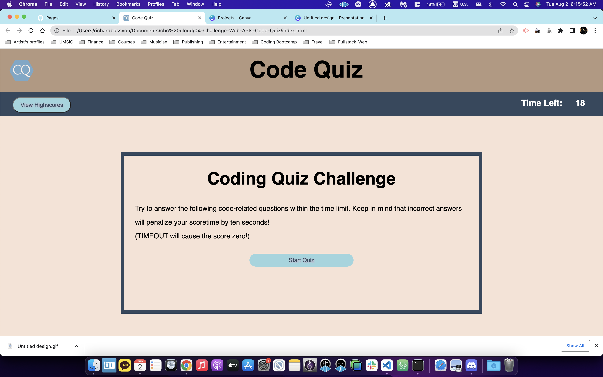
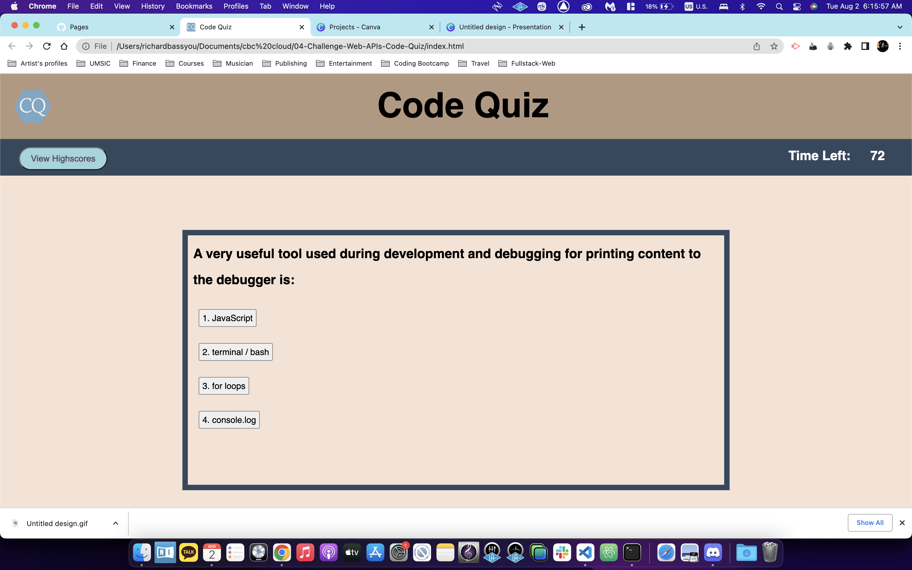
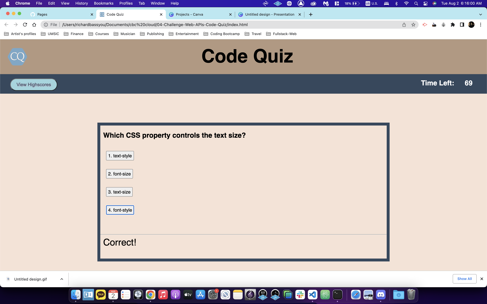
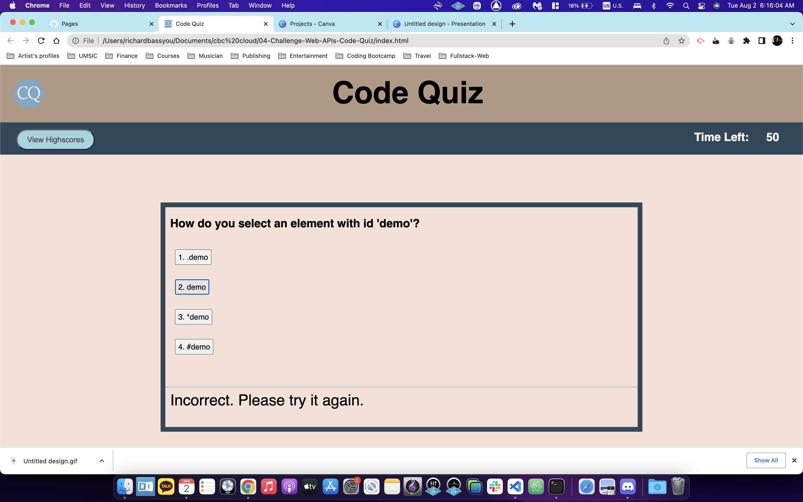
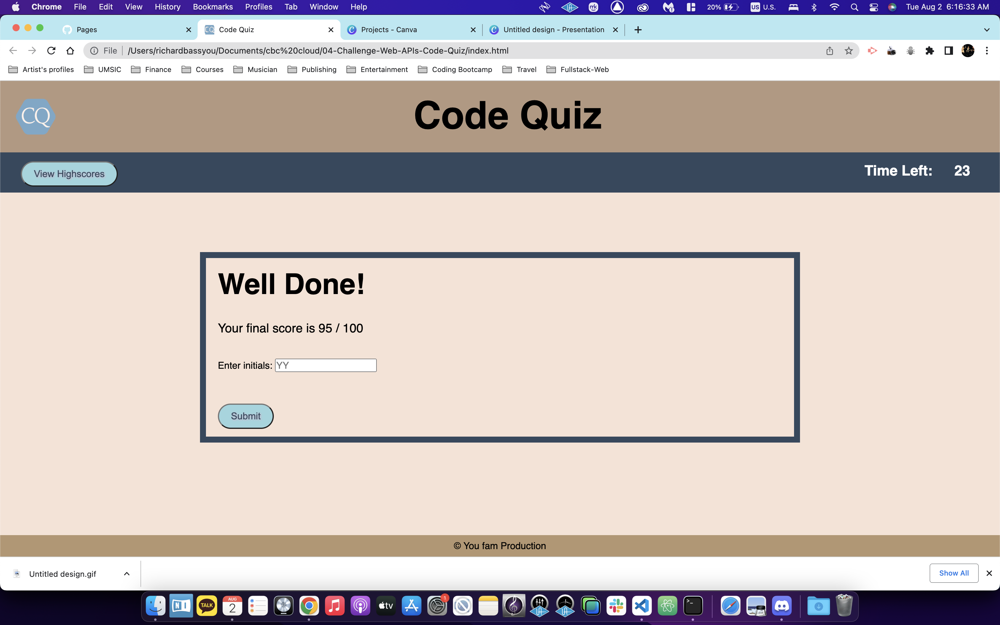
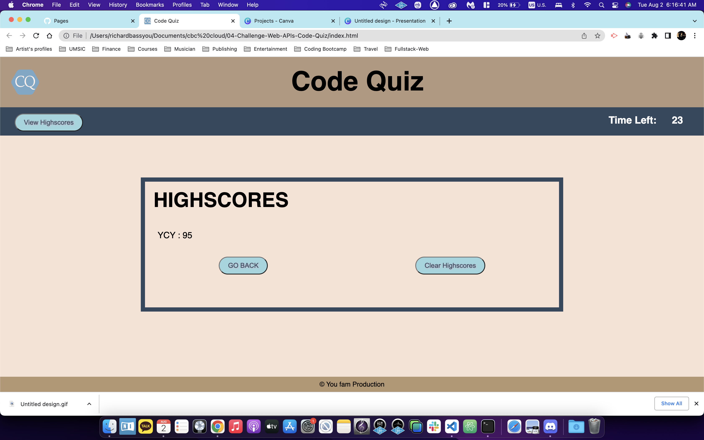
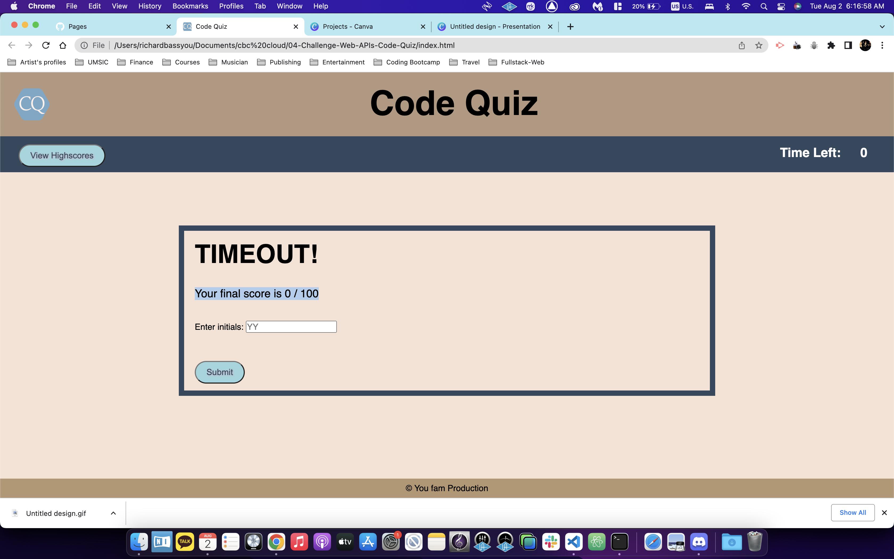
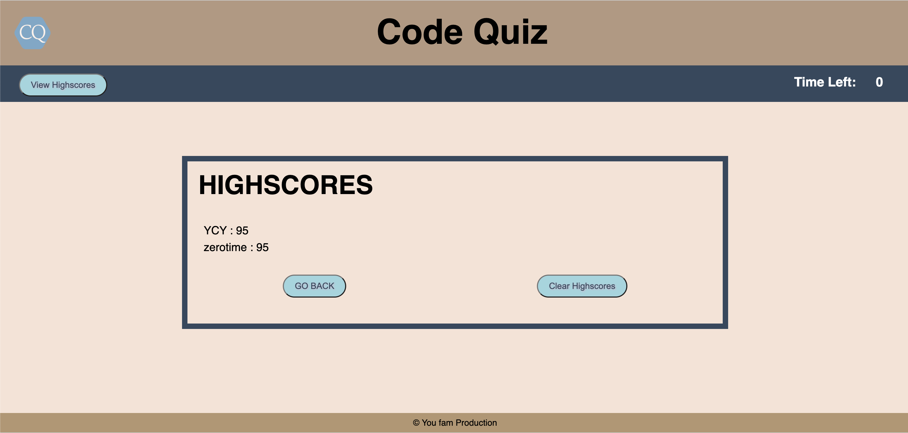
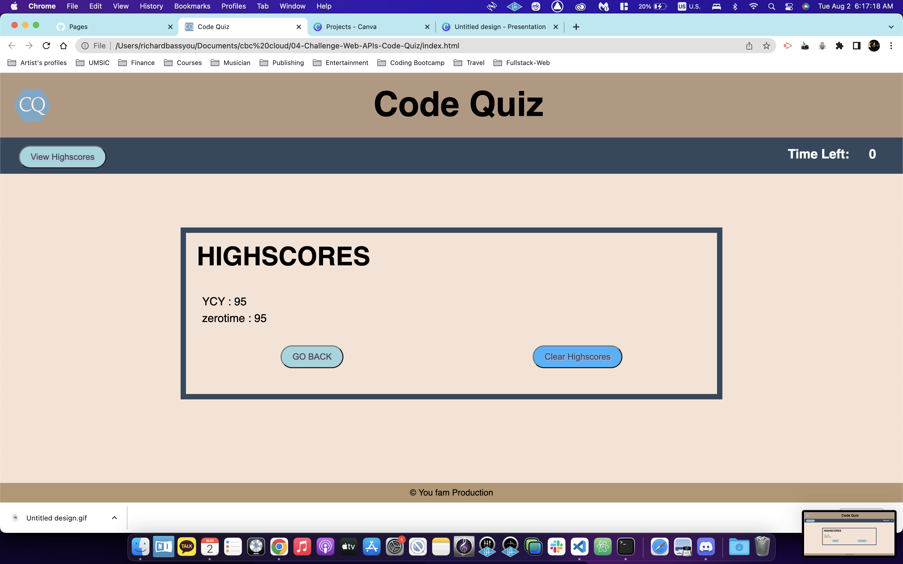
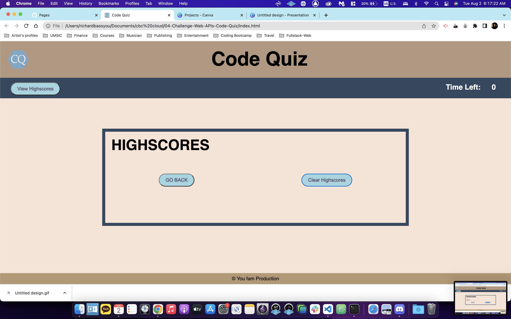

# 04-Challenge-Web-APIs-Code-Quiz
Challenge No.4 for UCI Coding Bootcamp

## Developer

Yi Chan You, (Richard) 

## My Task

I made coding quiz with 20 questions that starts timer with 75 seconds. 
Every time it get incorrect take out the 15 seconds from timer Left, and 5 points off from 100 points.
If timer reach to zero, the final Score automatically becomes 0. 
We can submit the score with initials (names are allow) to the log.
Then, also we can clear highscores from the list, in order to start again. 
Anytime we can access to view highscores in the web. 

## Link to deployed application

[Link to the deployed page](https://yichanyourichard.github.io/04-Challenge-Web-APIs-Code-Quiz/)

## Screenshots / gif.file of the Web Api - Code Quiz

